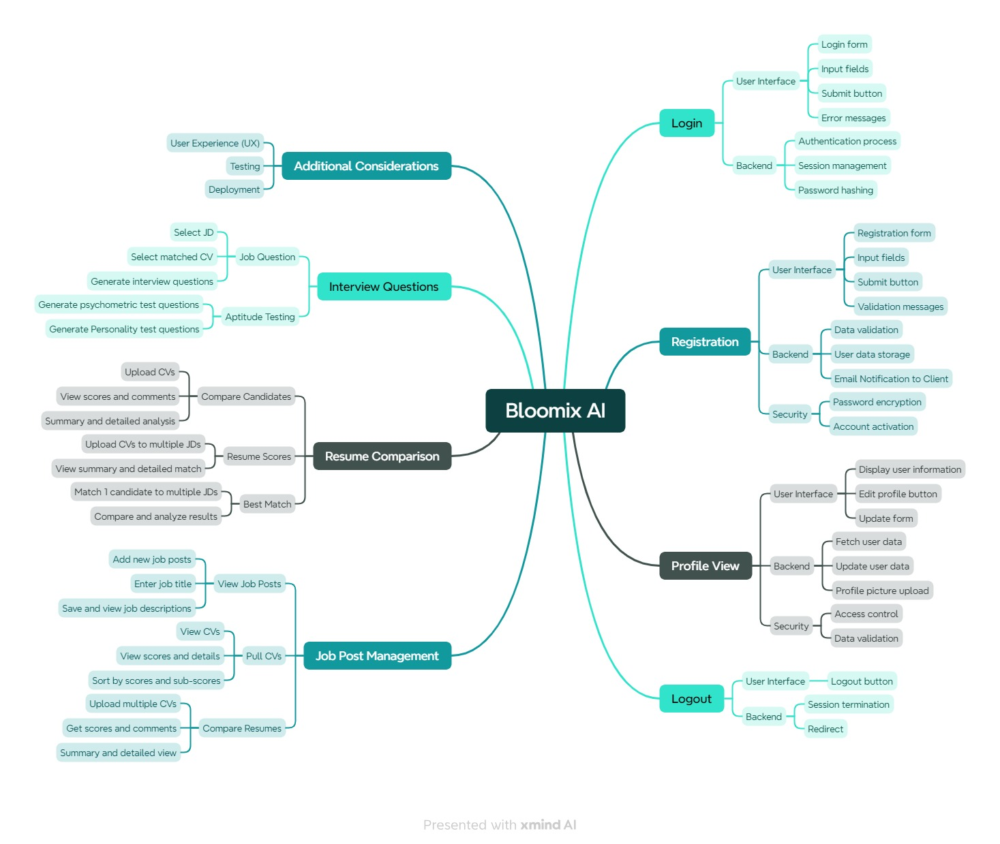

# Bloomix AI - Feature Overview and Functional Mindmap



This repository contains the **Bloomix AI** functional mindmap and the accompanying test and feature documentation. The project aims to provide an in-depth overview of various key functionalities within the Bloomix AI platform, covering everything from **Login and Registration** workflows to **Resume Comparison** and **Job Post Management**.

## 🧠 Mindmap Overview

The provided mindmap outlines the core functionalities of Bloomix AI, focusing on several modules:

- **Login/Logout**: User authentication, session management, and security features.
- **Registration**: User data storage, validation, and account activation.
- **Profile View**: User profile data fetching and editing capabilities.
- **Resume Comparison**: Comparison of candidate resumes against job descriptions with scoring and detailed analysis.
- **Job Post Management**: Job post creation, management, and CV scoring functionalities.
- **Interview Questions**: Generating interview and psychometric test questions tailored to job candidates.
- **Additional Considerations**: Covering aspects like testing, deployment, and user experience (UX) optimization.

### 🗂 Download the Mindmap

To view the detailed breakdown of all Bloomix AI features, download the mindmap file below:

- [Bloomix AI Mindmap (Excel)](https://github.com/REFATBHUYAN/Bloomix_AI_Website_MindMap/blob/main/Bloomix_AI_Website_MindMap.xlsx)

## 📋 Key Features

### 1. **Login**
- **User Interface**: 
  - Input fields for email and password.
  - Submit button and error message display for invalid credentials.
- **Backend**: 
  - Authentication and session management.
  - Secure password hashing.
- **Security**: 
  - Ensure secure login and protection against common threats.

### 2. **Registration**
- **User Interface**: 
  - User-friendly registration form with validation messages for incorrect input.
- **Backend**: 
  - User data storage and account activation workflow.
  - Email notifications to the client for account creation confirmation.
- **Security**: 
  - Password encryption and secure account activation process.

### 3. **Profile View**
- **User Interface**: 
  - Ability to edit and update user profiles.
  - Profile picture uploads and personal information display.
- **Backend**: 
  - Fetching and updating user data.
- **Security**: 
  - Access control to protect personal user information.

### 4. **Resume Comparison**
- Upload and manage multiple CVs.
- **Detailed Analysis**: 
  - Compare resumes against job descriptions.
  - View scores, comments, and detailed analysis.
- **Best Match**: 
  - Match candidates to job descriptions and view a summary of the best matches.

### 5. **Job Post Management**
- **Create New Jobs**: 
  - Add job titles, save, and manage job descriptions.
- **View & Compare**: 
  - View CVs and analyze scores for each job post.
- **Upload and Analyze**: 
  - Upload multiple CVs and compare them for suitability against job descriptions.

### 6. **Interview Questions**
- Generate custom interview questions based on the job description.
- **Psychometric & Personality Tests**: 
  - Include additional tests for a more comprehensive evaluation.

### 7. **Additional Considerations**
- **Testing & Deployment**: 
  - Ensure Bloomix AI is rigorously tested for bugs, user experience, and performance.
  - Prepare the platform for deployment with UX optimizations.

## 🚀 Getting Started

To explore the full scope of features and functionalities in Bloomix AI, follow the steps below:

1. **Clone the Repository**:  
   ```bash
   git clone https://github.com/REFATBHUYAN/Bloomix_AI_Website_MindMap
   ```
   
2. **Access the Mindmap & Documentation**:  
   - Open the mindmap image and Excel file for a detailed view of each module.
   - The Excel file contains all test cases and detailed feature descriptions.

3. **Contribute**:  
   Feel free to submit issues or contribute improvements to the repository.


